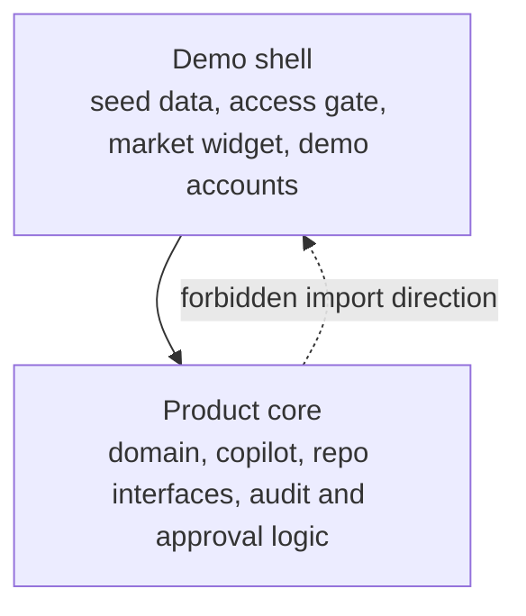

# Beacon Architecture

Beacon is split into two layers: **Product core** and **Demo shell**. The shell can depend on the core. The core must not import shell paths.



## Product Core

Product core is the code that should travel with an implementation:

- `lib/domain`: client signals, governance metrics, risk/compliance calculations.
- `lib/copilot`: copilot modules, deterministic guards, approval state, draft/talking-point orchestration.
- `lib/repo`: repository interfaces and product-facing data contracts.
- Approval and audit logic used by client-facing workflows.
- `components/copilot` and `components/ai`: reusable AI interaction surfaces and output review UI.

Core code can depend on other core code, product utilities, and third-party packages. When it needs data, environment, or demo runtime behavior, the dependency should be inverted behind an interface owned by core.

## Demo Shell

Demo shell is useful for local rehearsals and sales environments, but should stay outside core:

- `data/asia-wealth/bundle.json`: generated demo seed bundle.
- `scripts/generate-data.ts` and other scripts used to create or validate demo data.
- `lib/auth/access-gate` and `/access`: demo access-code flow.
- `lib/auth/accounts`: demo account wiring.
- `components/market`: demo market-tone widget.
- `promo/`: demo landing shell.

Shell code may import core modules to render or exercise the product. Core modules must not import shell paths directly.

## Boundary Check

Run:

```bash
npm run check-architecture
```

The checker scans these core roots:

- `lib/domain`
- `lib/copilot`
- `lib/repo`
- `components/copilot`
- `components/ai`

It fails when a core file imports a demo-shell path such as demo seed data, scripts, the access gate, demo accounts, the access page, the market widget, or promo shell code. `npm run check-data` includes this check so data refresh and architecture validation stay together.
